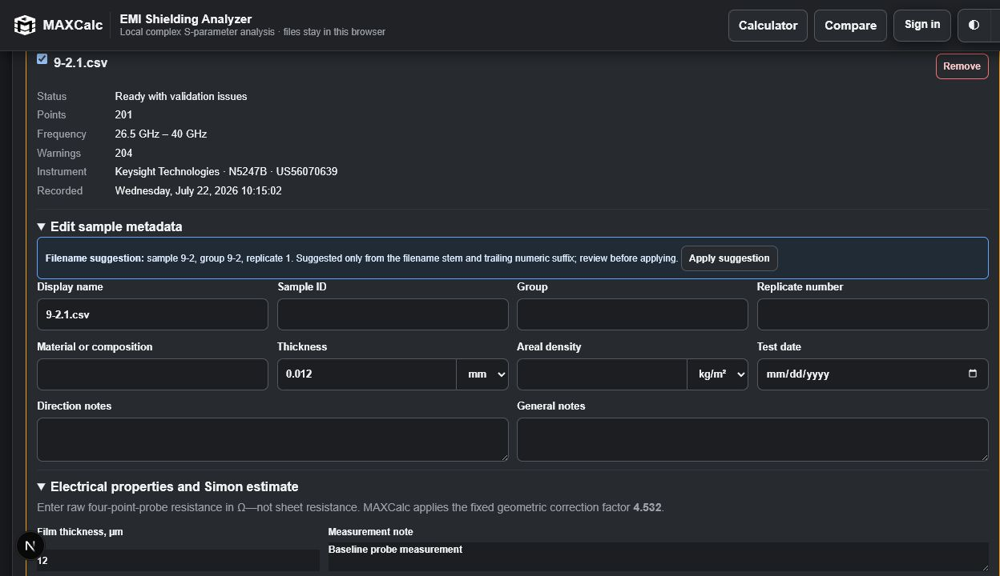
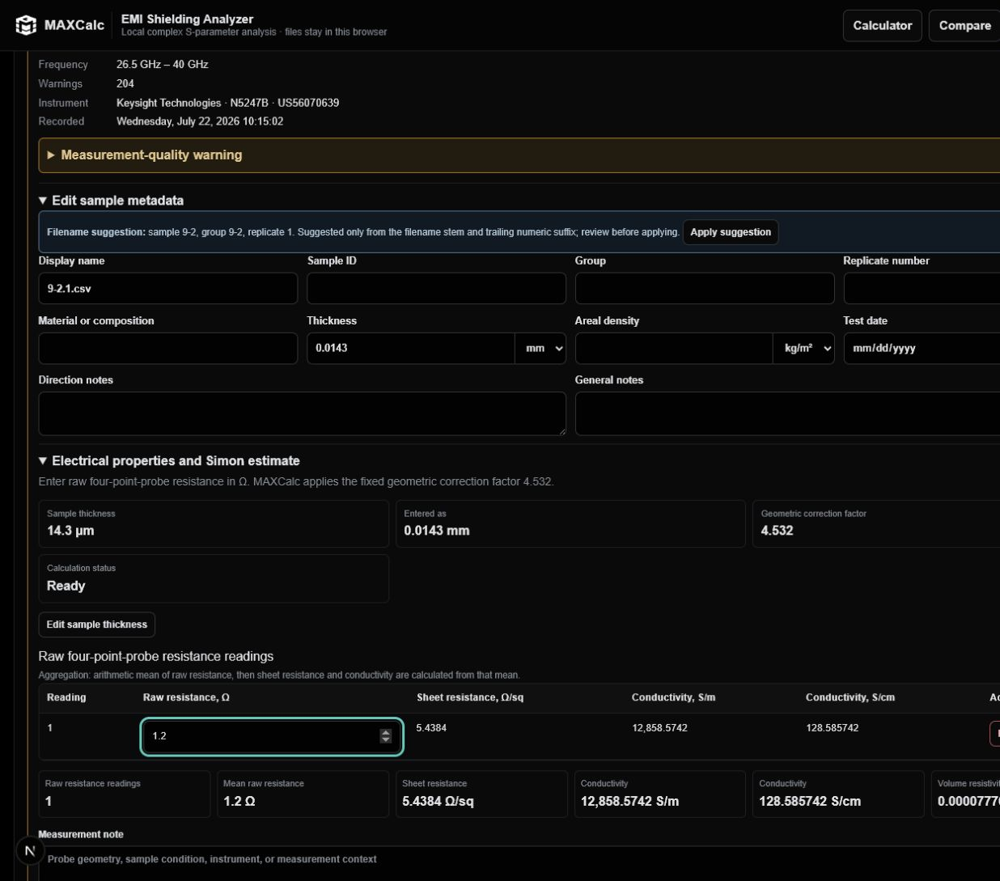
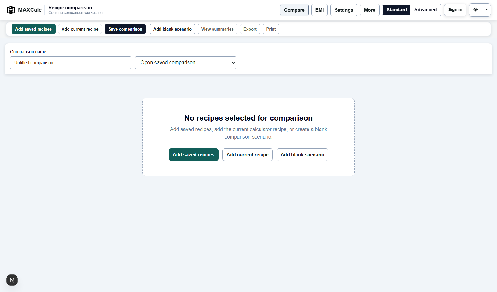
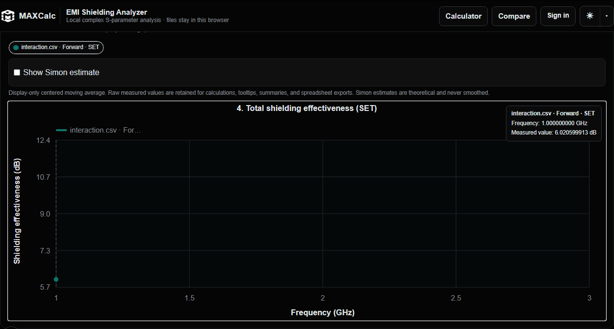
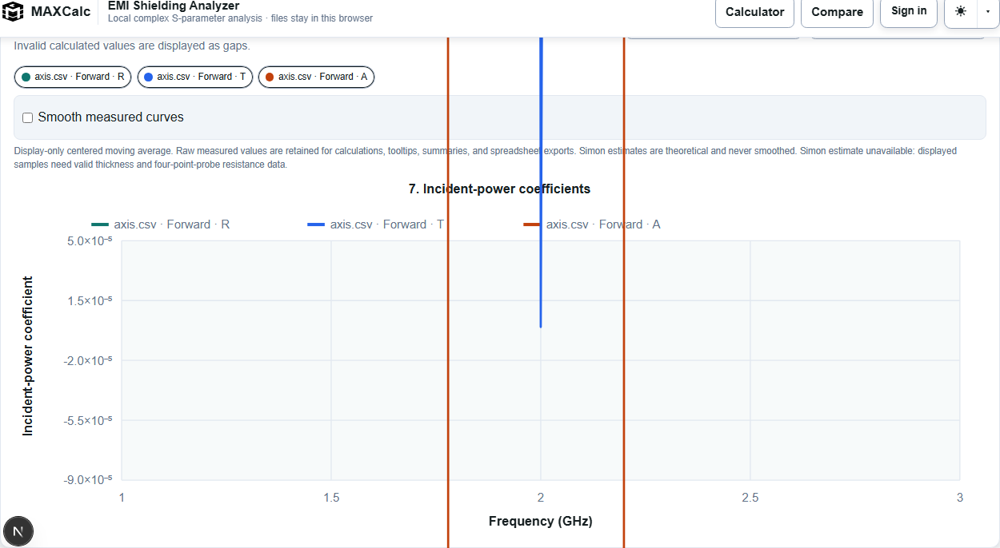
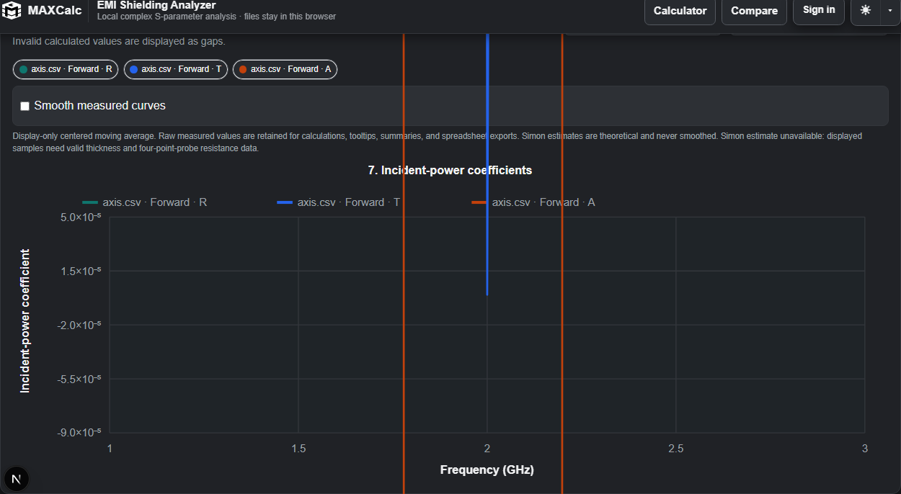
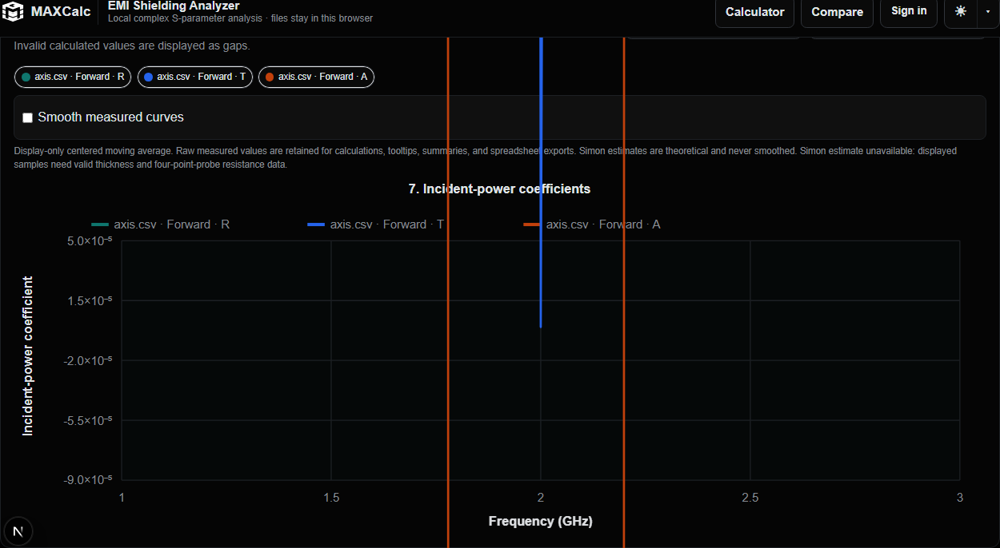
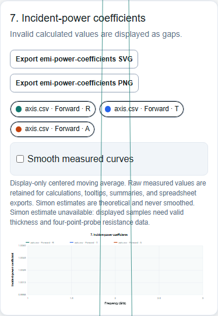

# EMI thickness and graph UI fix report

Date: 2026-07-27

## Scope and scientific boundary

This repair addresses the authoritative EMI thickness path, the shared Standard/Advanced control, and graph y-axis presentation. It does not change four-point-probe, resistivity, conductivity, Simon, measured EMI, smoothing, interpolation, summary, or export equations. Axis padding and tick strings are presentation-only.

## Thickness propagation root cause

The metadata unit selector rendered with `value={metadata.thicknessUnit ?? "mm"}`, but newly imported dataset metadata stored only `displayName`. The UI therefore looked like `mm` was selected without committing `thicknessUnit: "mm"` to application state. Entering `0.0143` stored the number alone. The authoritative selector correctly required both a positive finite number and a supported unit, returned no normalized value, and the electrical section consequently reported `Not entered`.

This was not a stale memo, delayed save, alternate sample object, or retained editable electrical field. It was a visually defaulted but absent state property at the metadata-to-selector boundary.

## Authoritative state and conversion path

The live path is now:

```text
metadata thickness + persisted unit
  -> normalizeEmiThickness(value, unit)
  -> micrometers / millimeters / centimeters / meters
  -> read-only electrical editor
  -> four-point-probe summary
  -> Simon eligibility and exact measured-frequency series
  -> project snapshot and normalized export models
```

`packages/chemistry-engine/emi/replicates.ts` owns the sole conversion table. Supported existing units remain `m`, `mm`, `um`, and `in`; invalid, nonfinite, zero, and negative values return no normalized thickness. Components and project adapters call this pure path instead of reimplementing factors.

New imports store `thicknessUnit: "mm"`, matching the selector's visible default. Both number and unit edits update current React project state, rebuild any derived electrical record, and immediately recompute the electrical summary and Simon trace. The electrical section displays normalized micrometers and, when different, the entered representation; it remains read-only.

## Numerical reference case

For `0.0143 mm`, `1.2 ohm`, and correction factor `4.532`:

| Quantity | Result |
| --- | ---: |
| Thickness | `14.3 um` |
| Thickness | `0.0143 mm` |
| Thickness | `0.00143 cm` |
| Thickness | `0.0000143 m` |
| Sheet resistance | `5.4384 ohm/sq` |
| Conductivity | `12858.57420014525 S/m` |
| Conductivity | `128.5857420014525 S/cm` |

The UI formats the two conductivity values as `12,858.5742 S/m` and `128.585742 S/cm` while the calculation object retains normal JavaScript numeric precision. Changing the metadata value to `0.0200 mm` updates the display to `20 um` and recalculates immediately; entering `20 um` produces the equivalent result.

## Persistence compatibility

Current project schema and IndexedDB structure are unchanged. Schema-2 and schema-3 parsing remains supported. A historical metadata record with a positive thickness but no stored unit is adapted to `mm`, because that was the unit the historical UI displayed. Legacy electrical-only thickness continues to normalize into metadata at the compatibility boundary. Conflicting metadata and legacy values retain the existing unresolved-conflict policy and are never silently selected.

Local save/reopen, JSON backup/restore, XLSX generation, and existing synchronization serialization continue to carry the same project record. No duplicate live thickness field was introduced.

## Compare segmented-control root cause and repair

Compare contained duplicate segmented-control JSX inside a route-specific wrapper. The shared `.segmented-control` rules did not establish flex layout on their own; calculator markup happened to add a utility flex class, while Compare did not. The active Compare segment therefore inherited incorrect sizing and appeared as a thin strip.

Both routes now render `components/site/detail-mode-control.tsx`. The component owns the same labels, pressed-state semantics, focus/hover behavior, shared class, and active styling. Route code supplies only its accessible label and existing mode state. Computed browser checks report the same 40 px outer height, 34 px active height, 3 px top and bottom inset, padding, line height, and border radius on calculator and Compare across Light, Dark, Midnight, desktop, tablet, and the supported narrow breakpoint.

## Y-axis root cause and formatting strategy

The plot previously formatted each tick independently with a generic magnitude threshold. That mixed fixed and exponential strings on one axis and exposed floating-point noise. Layout always reserved a 72 px left margin and placed the vertical title at a fixed coordinate, regardless of the widest label.

`lib/emi/graph-axis.ts` now builds one deterministic axis model from quantity, visible finite values, optional presentation bounds, and tick count. It:

- pads the visible domain without clamping negative coefficients or forcing coefficients into 0-1;
- creates a useful domain for constant and nearly constant series;
- selects precision from tick spacing;
- uses a single fixed or scientific notation for the entire axis;
- normalizes negative zero and prevents duplicate labels;
- estimates the widest tick and allocates a bounded 72-132 px left margin;
- leaves tooltips, summaries, persisted data, and exported numeric values unchanged.

The required screenshot range now formats approximately as `0.0050`, `0.0021`, `-0.0009`, `-0.0039`, and `-0.0068`. A representative real-data graph measured about 30.6 px of clearance between the rotated title and the nearest tick label.

## Visual evidence

Historical duplicate-input baseline (before the single authoritative model):



Live metadata-to-electrical propagation after repair:



Shared Compare control after repair:



Standard, scientific, and mobile axis captures:











## Regression coverage

- Exact thickness conversions and rejection of invalid/nonfinite inputs.
- Exact `0.0143 mm` electrical reference case and unchanged Simon equations.
- Schema-2 missing-unit migration plus established conflict behavior.
- Axis domains `[31.486, 53.076]`, `[-0.0068426, 0.0050493]`, `[-0.00008967, 0.00005049]`, `[0.9998, 1.006]`, `[0, 0]`, `[1e-12, 1.1e-12]`, and `[-1000, 1000]`.
- No duplicate labels, negative zero, NaN, Infinity, mixed notation, or title collision.
- Browser propagation through value and unit changes without save/reload.
- Calculator/Compare computed-style equality across three themes and three responsive widths.
- Light, Dark, Midnight, tiny-range, ordinary-range, and mobile screenshots.

## Remaining limitations

- Axis width uses a deterministic font-width estimate rather than an SVG text-measurement pass. The bounded estimate is covered by collision tests for the required ranges and current font stack.
- The existing fixed-aspect SVG becomes visually dense on very narrow phones; this task prevents label/title overlap but intentionally does not redesign the responsive chart or application header.
- EMI projects remain local in the current product architecture; compatibility was verified through the existing project, backup, export, and synchronization serialization paths rather than adding a new EMI-specific cloud model.

## Final validation

- TypeScript: passed.
- ESLint: passed with zero warnings.
- Unit, scientific, migration, persistence, and export tests: 537 passed across 42 files.
- Full Playwright suite: 141 passed and 4 existing credential/configuration-gated tests skipped.
- Production Next.js build: passed, including `/emi`, `/workspace`, and `/compare`.
